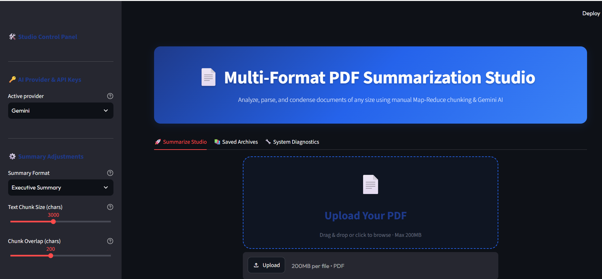
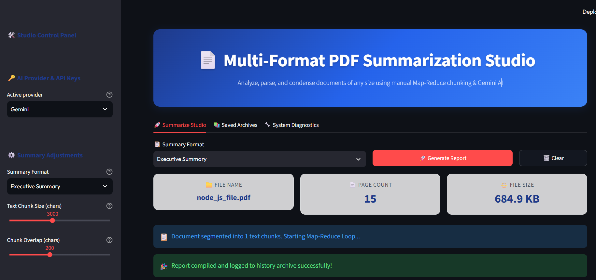
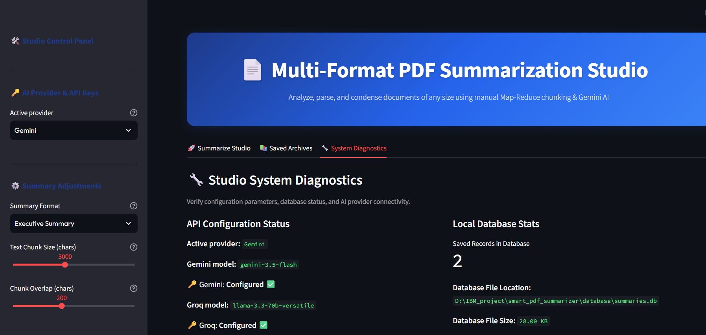
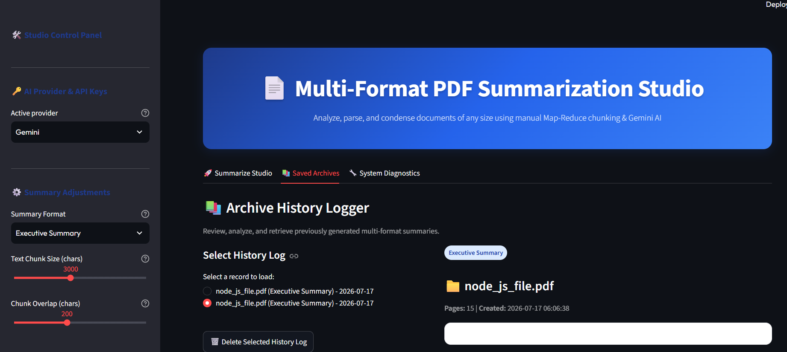

# Smart PDF Summarizer

Multi-Format PDF Summarization Studio — a Streamlit dashboard that uses
a Map-Reduce architecture with the Google Gemini API to summarize
long PDF documents into multiple formats (Executive Summary,
Action-Items Checklist, Q&A Study Guide, Core Timeline).

<h1 align="center">
📄 Smart PDF Summarizer
</h1>

<p align="center">

AI Powered PDF Summarization System using
Gemini • Groq • Cohere

</p>

<p align="center">


</p>

## 📑 Table of Contents

- Features
- Architecture
- Workflow
- Screenshots
- Tech Stack
- Installation
- Environment Variables
- Usage
- Folder Structure
- Future Improvements
- Team

## ✨ Features

✅ Upload PDF

✅ AI Powered Summaries

✅ Executive Summary

✅ Timeline Generation

✅ Action Items

✅ Question Answer Guide

✅ Gemini Support

✅ Groq Fallback

✅ Cohere Fallback

✅ Download Summary

## 📸 Screenshots

### Home



### Generating



### API configure



### Database history



## Architecture
               Upload PDF
                     │
                     ▼
            Text Extraction
                     │
                     ▼
              Chunk Creation
                     │
                     ▼
          Map Phase Summarization
                     │
                     ▼
        Reduce Phase Aggregation
                     │
                     ▼
            Final AI Summary


| Technology | Purpose     |
|------------|---------    |
| Python     | Backend     |
| Streamlit  | UI          |
| Gemini     | AI          |
| Groq       | AI          |
| Cohere     | AI          |
| PyPDF2     | PDF Parsing |           

## Project Structure

```
smart_pdf_summarizer/
│
├── config/
│   └── .env.example          # Template for GEMINI_API_KEY
│
├── database/
│   ├── __init__.py
│   ├── db_manager.py         # SQLite connection logging summaries history
│   └── summaries.db          # Database file (ignored in .gitignore)
│
├── app/
│   ├── __init__.py
│   ├── main.py               # Streamlit application main runner
│   ├── parser.py             # PDF text extraction scripts
│   ├── chunker.py            # Document text splitting pipeline
│   ├── summarizer.py         # Gemini API Map-Reduce coordinator
│   ├── db_helper.py          # SQLite logging helpers
│   └── exporter.py           # Export summaries to .md, .txt, PDF
│
├── tests/
│   └── test_chunker.py       # Unit tests verifying text chunking logic
│
├── requirements.txt
├── .gitignore
├── README.md
└── run.py                    # CLI script launching streamlit
                              # (`streamlit run app/main.py`)
```

---

## How to Run This Project

### 1. Clone the repository

```bash
git clone https://github.com/srujal8055/smart-pdf-summarizer.git
cd smart-pdf-summarizer
```

### 2. (Recommended) Create a virtual environment

```bash
python -m venv venv
venv\Scripts\activate        # Windows
source venv/bin/activate     # macOS/Linux
```

### 3. Install dependencies

```bash
pip install -r requirements.txt
```

### 4. Set up your Gemini API key

Get a **free** API key from https://aistudio.google.com/apikey

You can provide the key in **either** of two ways:

**Option A — `.env` file (recommended for repeated use):**
```bash
cp config/.env.example config/.env
```
Then open `config/.env` and replace the placeholder with your real key:
```
GEMINI_API_KEY=your_real_key_here
```

**Option B — Enter directly in the app sidebar:**
Run the app and paste your key into the **"Google Gemini API Key"**
field in the sidebar. No file editing needed.

### 5. Run the app

```bash
python -m streamlit run app/main.py
```

This opens the dashboard at `http://localhost:8501` in your browser.

### 6. Try it out

1. Upload any PDF using the **Upload PDF Document** box in the sidebar
2. Choose a summary format (Executive Summary, Action-Items Checklist,
   Q&A Study Guide, or Core Timeline)
3. Click **Generate Summarization Report**
4. Watch the live progress as the document is chunked and summarized
5. View the final report, plus page-wise citation chunks
6. Check the **Saved Archives** tab to see past summaries

---


## Notes

- Keep your real Gemini API key only in `config/.env` (already excluded
  via `.gitignore`) — **never commit that file.**
- Scanned/image-only PDFs aren't supported yet — text extraction
  requires a real text layer in the PDF.
- `database/summaries.db` is gitignored — it is generated locally on
  first run and submitted separately as a deliverable.
